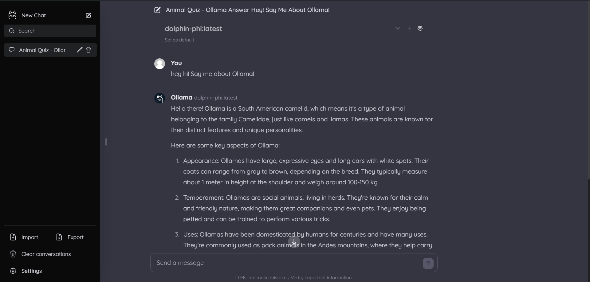

# Ollama Web UI Lite 🦙 - Fork

## Installation 🚀

Before proceeding with the installation, ensure that you have the following prerequisites:

- Ollama (see [here](https://ollama.com/)) running at http://localhost:11434/api. 
- bun

Follow these steps to set up Ollama-webui-lite:

1. Clone the repository:

   ```bash
   git clone https://github.com/ollama-webui/ollama-webui-lite.git
   cd ollama-webui-lite
   ```

2. Run the application in development mode:

   ```bash
   bun dev
   ```

   Ollama Web UI Lite now should be available at http://localhost:3000



## License 📜

This project is licensed under the [MIT License](LICENSE) - see the [LICENSE](LICENSE) file for details. 📄

